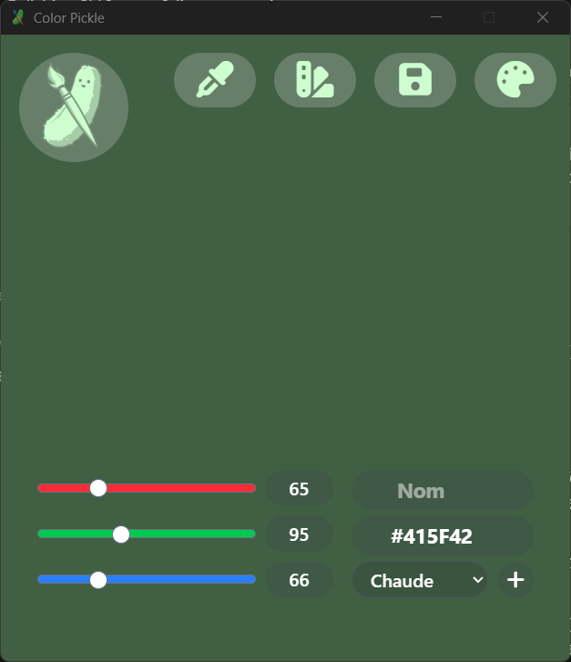
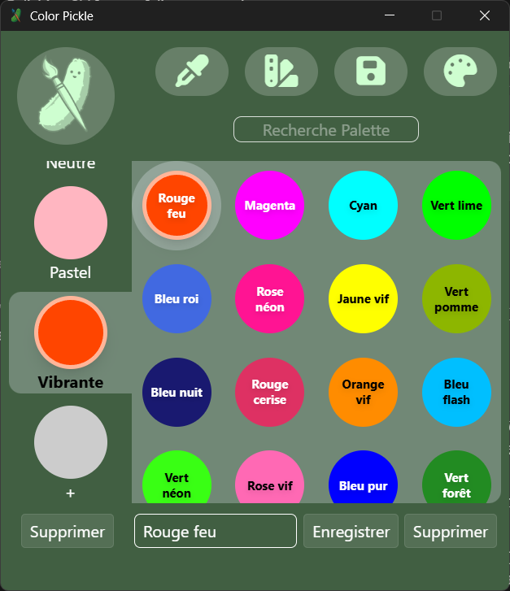
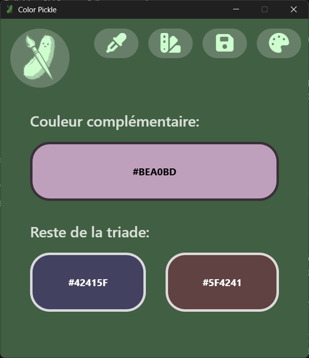
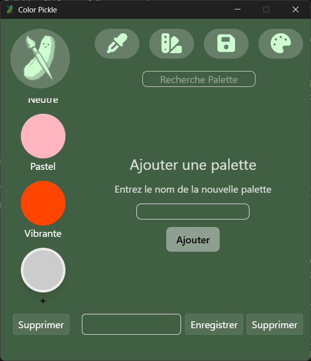
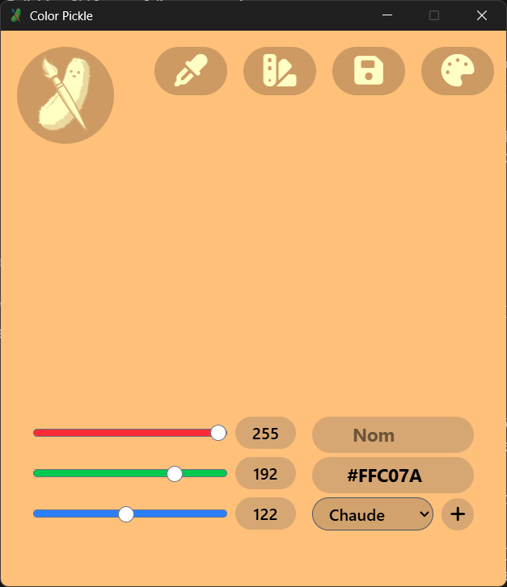

# 🎨 ColorPickle — Gestionnaire de Palettes de Couleurs

> Application de bureau native permettant de créer, personnaliser, convertir et organiser des palettes de couleurs — construite avec **Tauri 2** et **Vue 3**.


<br>

## 📸 Aperçu

| Accueil                               | Palettes                                | Utilitaires                                   | 
| ------------------------------------- | --------------------------------------- | --------------------------------------------- |
|  |  |  |

<br>

## ✨ Fonctionnalités

- **Navigation à 3 vues** — Accueil (statistiques globales), Palettes (collection filtrable/recherchable), Utilitaires (conversion et sélection de couleurs interactive).
- **Color Picker** - Récupérer la couleur partout, sur n'importe quel écran en temps réel, puis l'afficher à l'accueil
- **Création de palettes** — formulaire avec validation front-end (nom obligatoire) et messages d'erreur/succès dynamiques.
- **Gestion complète (CRUD)** — ajout, modification, suppression et filtrage en temps réel.
- **Conversions automatiques** — HEX / RGB calculées à la volée.

<br>

## 🖼️ Fonctionnalités en images

### Création et validation d'une palette


_Formulaire avec validation_

### Conversion de couleurs


_Conversion instantanée des valeurs RGB / HEX_

<br>

## 🛠️ Stack technique

| Couche             | Technologie                               |
| ------------------ | ----------------------------------------- |
| Desktop            | Tauri 2 (backend Rust minimal)            |
| Frontend           | Vue 3 (Composition API, `<script setup>`) |
| Langage            | TypeScript                                |
| Build              | Vite                                      |
| Gestion de paquets | npm                                       |
| Routage            | Vue Router                                |

> **Pourquoi TypeScript ?** Le projet utilise un typage strict des structures de données (`Palette`, `Couleur`) afin d'éviter les erreurs de conversion au runtime.

<br>

## 🚀 Installation et lancement

**Prérequis**

- Node.js (version LTS recommandée)
- Rust & dépendances système Tauri (pour le backend natif)

```bash
# 1. Installer les dépendances
npm install

# 2. Lancer l'application en mode développement
npm run tauri dev
```

Une fenêtre de bureau native s'ouvre avec l'interface Vue.js.

<br>

## 🗂️ Structure du projet

Pour le détail complet de l'architecture et de l'arborescence des fichiers, voir [architecture-application.md](./architecture-application.md).

<br>

## 📚 Contexte du projet

Réalisé dans le cadre du travail pratique #2 (TP2) du cours _Développement d'application (bureau)_, présenté à Mme Lilia Ould Hocine — AEC en Développement Web / Programmation, Collège de Maisonneuve.

<br>

## 👥 Auteurs

- Mathieu Gosselin
- Clément Laflamme
- Francis Boisvert
